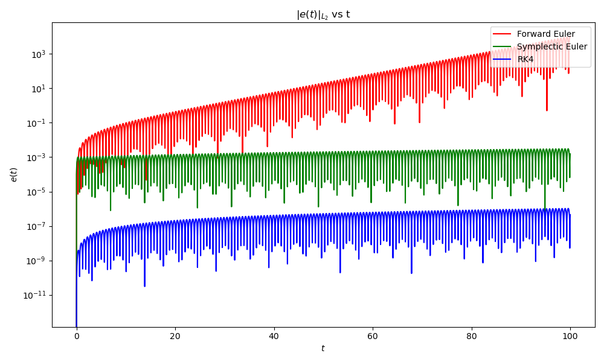
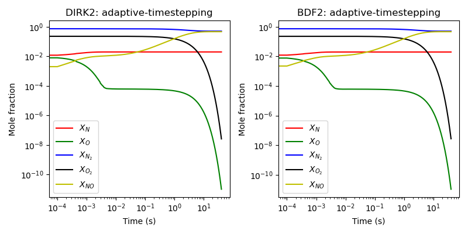

# APC523PS3
## Introduction
- Github repository for assignment 3 in APC523 is here: <a href = "https://github.com/ZINZINBIN/APC523PS3">https://github.com/ZINZINBIN/APC523PS3</a>
- Problem 1 and Problem 3 are noted by handwriting and code. The handwriting files are uploaded as "HW_03_prob_1_3.pdf", which contains 1-(a), 1-(b), and 3. 

## Problem 1.
### Problem 1.a
The derivation of the linear stability regime is derived and noted on HW_03_prob_1_3.pdf. We plot the linear stability diagram of the two-stage implict Runge-Kutta method which is represented as below.

    

        
    

The above figure shows that the two-stage implicit Runge-Kutta method has A-stability. In practice, however, the computation of k1 and k2 requires high computational cost if the problem has nonlinear behavior or other formula that is difficult to be computed compared to the linear case.

### Problem 1.b
The derivation of the linear stability regime for 2nd order and 3rd order of the explicit analogues of the Backward Differentiation Forumlas are noted on HW_03_prob_1_3.pdf. For the 2nd order case, we use the forward difference method with 3-points for approximating the time derivative of u, whereas we utilize 4-points for the approximation of the 3rd order case. The below figure depicts the linear stability regime of the 2nd order method, where the two different roots $\rho = \frac{u_{n+1}}{u_n}$ are obtained by solving the modal equation.

    

        
    

For the 3rd order case, we employ np.roots function to get 3 different roots of the ratio and the result is given as below.

    

        
    

## Problem 2.
Since this system is forced harmonic oscillator, the phase portrait should look like closed circle but move along the x-axis due to the external periodic force. The exact solution is given as $x(t) = \frac{F_m}{w^2 - w_f^2} (cos(w_f t) - cos(wt))$. There are two different cosine function with different frequencies. The first term is related to the forced harmonic oscilllation and the second term is related to natural frequncey. The first term has lower frequency and corresponds to the envelope of the graph for the system response The second term has higher frequency and consists of the vibration inside of the envelope of the graph. We can get the system response, phase portrait and $L_2$ error compared to the exact solution for each numerical method as below.

### Phase portrait

    

        
    

### System response

    

        
    

    

        
    

### $L_2$ error

    

        
    

We can figure out that forward euler method has failed to get the accurate value since the system response has exploded and the phase portrait shows diverging spiral curve. Comparing the computation time for each process and error, we can conclude that Runge-Kutta method has the highest accuarcy but requires more computation time. However, the symplectic euler method has still higer accuracy but requires less computation time compared to the Runge-Kutta method.

|  Method               | computation time            |
| -------------         | -------------               | 
| Forward Euler         |     6.3 x $10^{-6}$         | 
| Symplectic Euler      |     9.6 x $10^{-6}$         | 
| Runge-Kutta 4th order |     2.8 x $10^{-5}$         | 

We additionally plot the energy of the system computed by each numerical algorithm and the error with respect to the energy. It seems that the forward euler also diverges the energy but the symplectic euler and RK4 shows that the energy of the system is vibrating, which is consistent with that of the analytic solution.

    

        
    

    

        
    

## Problem 3.
The derivation of the modified energy and the proof for hamiltonian to be conserved in the second-order Verlet scheme is represented in HW_03_prob_1_3.pdf. Please see the materials.

## Problem 4.
### Problem 4.a
The ratio of the maximum eigenvalue and the minimum one from the Jacobian of this system at the initial time is $|\frac{\lambda_{max}}{\lambda_{min}}| = 1.52 \times 10^{31}$. Therefore, this system is stiff.

### Problme 4.b
We applied 5 different methods: RK4, DIRK2, BDF2, and DIRK2 with adaptive time-stepping and BDF2 with adaptive time-stepping. The computational result of the evolution of the sytem with RK4, DIRK2,and BDF2 is given as below.

    

        
    

In the case of adaptive time-stepping with DIRK2 and BDF2, we can get the below figure. 

    

        
    

The average computational times required for each time step are given below. DIRK2 has lower computational time compared to others and we can find that DIRK2 is more efficient in terms of not only accuracy but also the computational time compared to BDF2 although they are both second order method. BDF2 is implicit but it requires more computational time. 

|  Method           | computation time            |
| -------------     | -------------               | 
|  RK4              |     2.0 x $10^{-5}$         | 
|  DIRK2            |     9.0 x $10^{-6}$         | 
|  BDF2             |     4.4 x $10^{-5}$         |