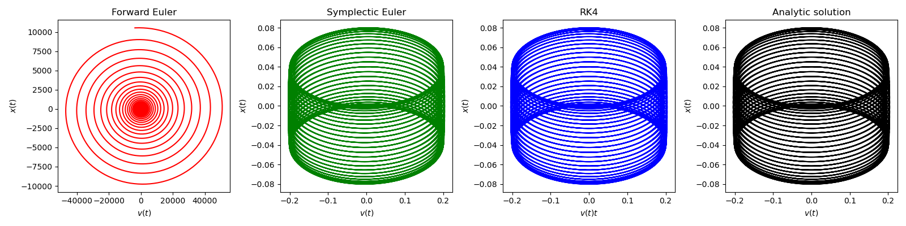

# APC523PS3
## Introduction
- Github repository for assignment 3 in APC523 is here: <a href = "https://github.com/ZINZINBIN/APC523PS3">https://github.com/ZINZINBIN/APC523PS3</a>

## Problem 1.

    

        
    

    

        
    

    

        
    

## Problem 2.

    

        
    

    

        
    

    

        
    

    

        
    

    

        
    

## Problem 3.

## Problem 4.

    

        
    

    

        
    

